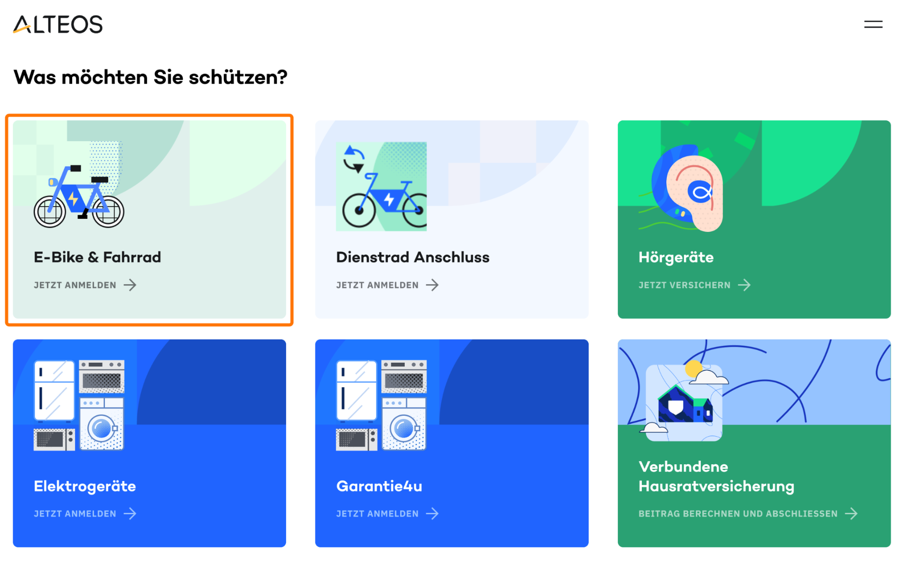

# Senior QA Automation Engineer homework

Welcome to the **Alteos Senior QA Automation Challenge**!  
This short exercise is designed to evaluate your ability to plan, design, and implement automated end-to-end (E2E) tests for a real-world web application scenario.

---

## Objective

1. You’ll create a **Test Plan**
2. And implement a small **Playwright + TypeScript** E2E test suite for one of our insurance products.

---

## Scenario

We’re focusing on the **E-Bike & Fahrrad** insurance product on our sandbox shop:

👉 [https://shop.sandbox.alteos.com/](https://shop.sandbox.alteos.com/)



---

## Task Instructions

1. **Download the repository:**

   - Use `git` and create a copy (`fork`) of this repository
   - Clone your fork to your local environment

2. **Test Planning:**

   - Visit the sandbox shop above.
   - Explore the **E-Bike & Fahrrad** product flow (see "orange square").
   - Create a **Test Plan** (in Markdown using a [table](https://www.markdownguide.org/extended-syntax/#tables)) that outlines:
     - Scope and test objectives
     - Key test scenarios
     - Functional test cases
     - Edge or negative test ideas
     - Other relevant aspects
   - Include this file as `test-plan.md`.

3. **Automation:**

   - Pick **1 - 2 test cases** from your plan.
   - Implement E2E tests using:
     - **TypeScript**
     - **Playwright**
   - Don’t spend more than **1 hour** on implementation.

4. **Execution:**

   - Add a short `README.md` section or script in `package.json` explaining:
     - How to install dependencies
     - How to run the tests
     - Any test configuration or environment setup steps
   - File structure **example**:
     ```bash
          qa-homework/
          ├── test-plan.md
          ├── tests/
          │   └── e-bike.test.ts
          ├── playwright.config.ts
          ├── package.json
          └── README.md
     ```

5. **Submission:**
   - Push your solution to a **public GitHub repository**.
   - Email us the **repository link** when you’re done.

---

## Technical Requirements

- Use the latest LTS version of **Node.js**
- Include a `package.json` with Playwright and TypeScript setup
- We prefer `pnpm` as package manager, but you can use `npm` or `yarn` if you prefer
- Follow best practices

---
